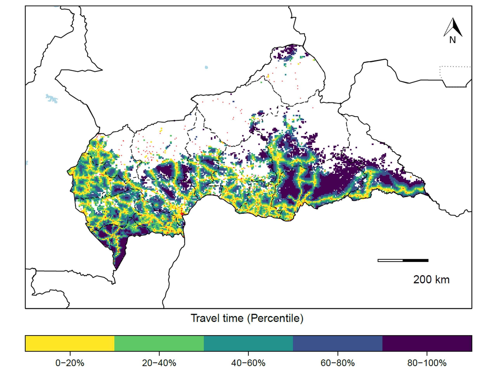
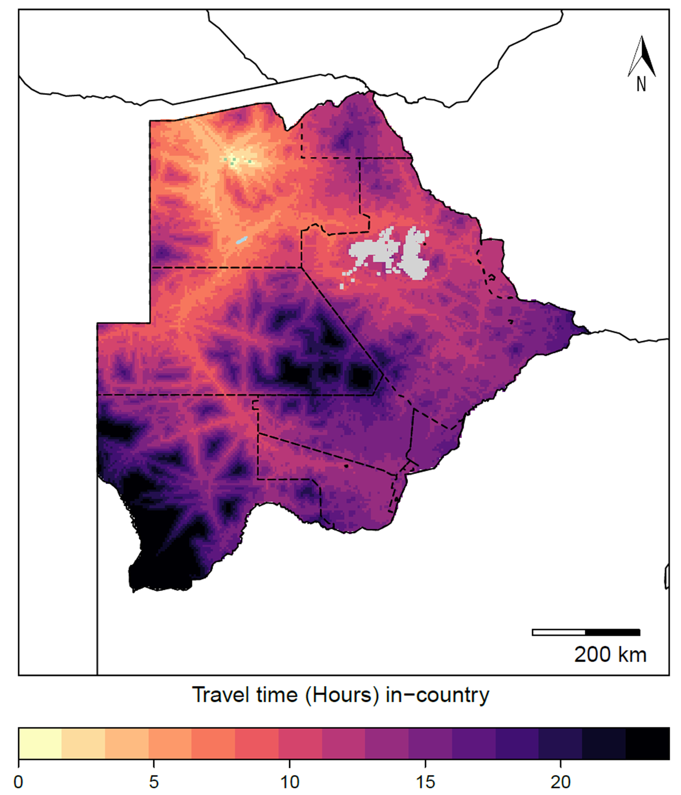
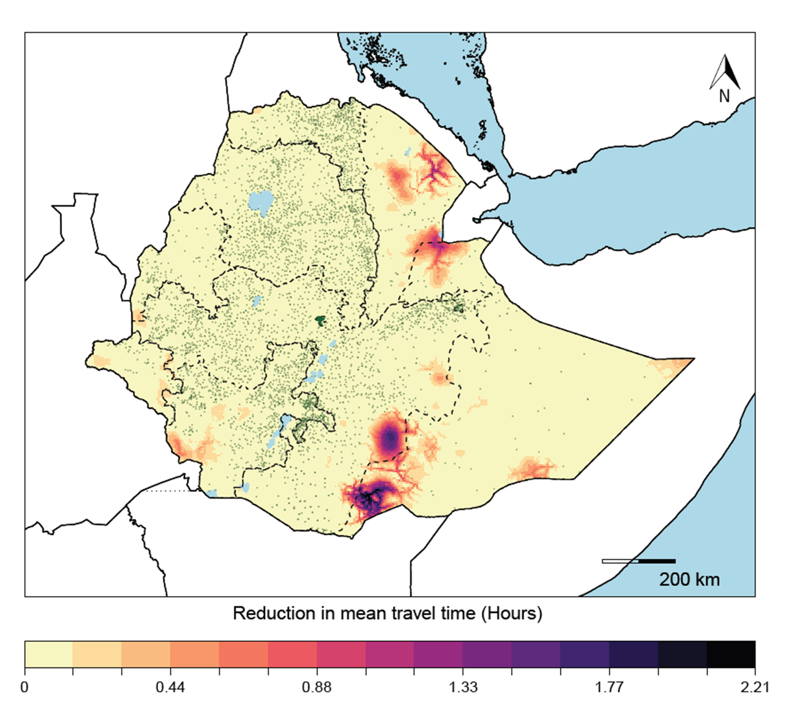
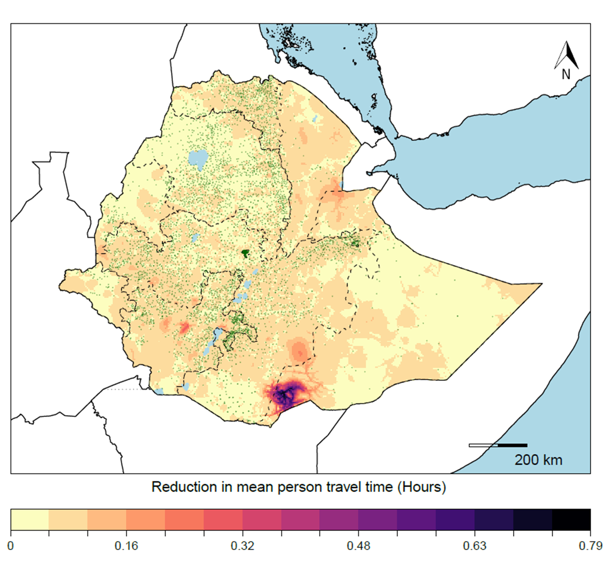

# Travel time to health facilities in areas of viral hemorrhagic fever outbreak potential: maps for guiding local preparedness and response - 2019

This repo contains the codes used to generate the raster files used to create the maps in the manuscript "Travel time to health facilities in areas of viral hemorrhagic fever outbreak potential: maps for guiding local preparedness and response". 

## The repo contains 2 files:

### 1) Travel_Time_Functions.R

This file generates the functions needed to produce the rasters used in the manuscript. Each of the functions is described subsequently:

`binary_threshold` : Converts a raster with continuous values into dichotomous presence (1) or absence (0) based on a user-defined threshold

`gen_mask` : Takes two rasters (or the same raster, twice) as inputs, and converts the values of the first raster to NA where the values are 0 in the second raster

`only_country` : Takes two rasters (or the same raster, twice) as inputs, and masks out values of the first raster to NA where the values are Inf in the second

`mask_lake` : Requires a country, directory, and shapefile of lakes (usually >100km) cropped to the country of interest, and returns a shapefile with the lakes cropped out in the directory provided

`generate_tt` : Requires a specified country and directory as well as a database of health facilities with latitude (named Latitude, numeric) and longitude (named Longitude, numeric), at minimum (but could contain other columns), and a raster file at 5x5-km resolution with binary classification of presence / absence of one or more pathogens. Can use `binary_threshold` to produce the binary classification, and may want to consider using `mask_lake` to produce a shapefile with lakes removed for calculating travel times (function will search for this file if it exists, but will not throw an error if it doesn't). This function returns raster *pathogen_access_raster* (5x5-km resolution) of travel times to the most accessible health facility from any grid-cell at risk for the pathogen specified. 

Examples of plots made with *pathogen_access_raster* from the manuscript include the following raw and percentile ranked travel times to health facilities from locations at-risk for at least one VHF in Central African Republic:

`generate_at_risk_areas` : Requires a specified country and directory as well as a database of health facilities with latitude (named Latitude, numeric) and longitude (named Longitude, numeric), at minimum (but could contain other columns), and a raster file at 5x5-km resolution with binary classification of presence / absence of one or more pathogens. Can use `binary_threshold` to produce the binary classification, and may want to consider using `mask_lake` to produce a shapefile with lakes removed for calculating travel times (function will search for this file if it exists, but will not throw an error if it doesn't). This function returns raster *pathogen.risk.access* (5x5-km resolution) of travel times to the most accessible at-risk location for the pathogen specified from any grid-cell not-at-risk. 

Examples of plots made with *pathogen.risk.access* from the manuscript include the following domestic and international travel times to areas-at-risk from locations not-at-risk in Botswana:

`generate_hospital_table` : Requires a specified country and directory as well as a database of hospitals only (named hospitals) with latitude (named Latitude, numeric) and longitude (named Longitude, numeric), at minimum (but could contain other columns), the raster *pathogen.risk.access* produced from `generate_at_risk_areas`, and the number of rows in the table you'd like to return (named num.rows). Returns a table called *hosp.table* of length num.rows, as specified in the function,  with travel times to hospitals. 

An example of the type of figure that could be created using this table is the list of the top 25 hospitals closest to areas-at-risk in the Republic of Congo:

`generate_new_infrastructure_split` : Requires a specified country and directory as well as a database of health facilities with latitude (named Latitude, numeric) and longitude (named Longitude, numeric), at minimum (but could contain other columns), and a raster file at 5x5-km resolution with binary classification of presence / absence of one or more pathogens. Can use `binary_threshold` to produce the binary classification, and may want to consider using `mask_lake` to produce a shapefile with lakes removed for calculating travel times (function will search for this file if it exists, but will not throw an error if it doesn't). This function converts the travel times to nearest health facility raster into a dataset of points - one per 5x5-km grid-cell - and then iterates over each point by placing new infrastructure in that point and recalculating travel times. Each country has it's points divided into segments of 1000, and this function iterates over each point in each segment. Returns a series of .RDS files, saved in a sub-folder (ROutputs) of "dir", of each set of 1000 points as a data frame with longitude (x), latitude (y), original mean (mean) of travel times, original mean of population-weighted travel times (ptt) as well as the reduction in travel times for that location - raw (mean_diff) and population-weighted (ptt_mean)
**WARNING: This step can be really time and computationally intensive - recommend running in parallel**

`generate_new_infrastructure_raw` : Requires a specified country and directory where the .RDS files from `generate_new_infrastructure_split` are saved (not including the sub-folder **ROutputs** in directory path), as well as a database of health facilities with latitude (named Latitude, numeric) and longitude (named Longitude, numeric), at minimum (but could contain other columns), and a raster file at 5x5-km resolution with binary classification of presence / absence of one or more pathogens. Can use `binary_threshold` to produce the binary classification, and may want to consider using `mask_lake` to produce a shapefile with lakes removed for calculating travel times (function will search for this file if it exists, but will not throw an error if it doesn't). This function returns raster *raw_int_travel* (5x5-km resolution) of raw reduction in travel times from the original assessment, per grid-cell, in minutes.

A example of a plot made with *raw_int_travel* from the manuscript includes a map of Ethiopia with the "raw" reduction in travel times per grid-cell:

`generate_new_infrastructure_weighted` : Requires a specified country and directory where the .RDS files from `generate_new_infrastructure_split` are saved (not including the sub-folder **ROutputs** in directory path), as well as a database of health facilities with latitude (named Latitude, numeric) and longitude (named Longitude, numeric), at minimum (but could contain other columns), and a raster file at 5x5-km resolution with binary classification of presence / absence of one or more pathogens. In addition, this function requires a raster of the population per grid-cell (at 5x5-km), cropped to the country of interest. May want to consider using `mask_lake` to produce a shapefile with lakes removed for calculating travel times (function will search for this file if it exists, but will not throw an error if it doesn't). This function returns raster *weighted_int_travel* (5x5-km resolution) of population-weighted reduction in travel times from the original assessment, per grid-cell, in minutes.

A example of a plot made with *weighted_int_travel* from the manuscript includes a map of Ethiopia with the population-weighted reduction in travel times per grid-cell:

### 2) Travel_Time_Plotting.R

This file provides plotting code with two functions for generating plots similar to those presented in the manuscript using `rasterVis`. Each of the functions is described subsequently:

`plot_tt_hours` : Uses a raster of travel times to health facilities in minutes and returns a plot of travel times in hours in the format of the manuscript. 

`plot_tt_pct` : Uses a raster of travel times to health facilities in minutes and returns a plot of travel times in percentiles in the format of the manuscript.

